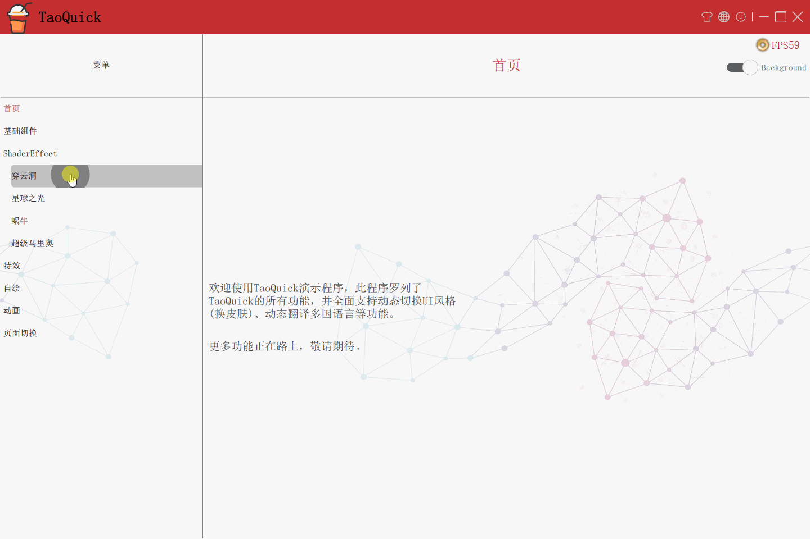
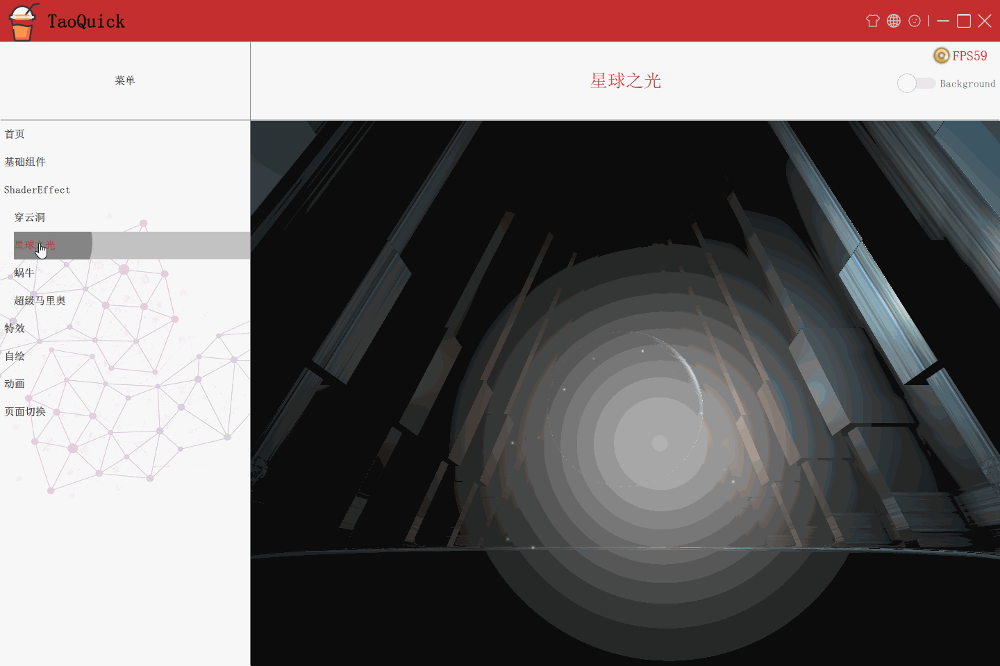
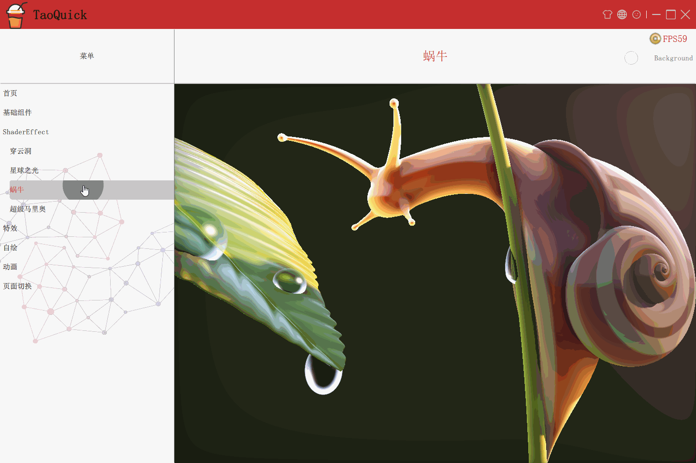

# 目录
- [目录](#%E7%9B%AE%E5%BD%95)
- [ShaderToy效果预览](#ShaderToy%E6%95%88%E6%9E%9C%E9%A2%84%E8%A7%88)
  - [穿云洞](#%E7%A9%BF%E4%BA%91%E6%B4%9E)
  - [星球之光](#%E6%98%9F%E7%90%83%E4%B9%8B%E5%85%89)
  - [蜗牛](#%E8%9C%97%E7%89%9B)
  - [超级马里奥](#%E8%B6%85%E7%BA%A7%E9%A9%AC%E9%87%8C%E5%A5%A5)

# ShaderToy效果预览

gif录制质量较低，可通过源码或github release页面发布的可执行程序，查看实际运行效果。

## 穿云洞

## 星球之光

## 蜗牛

## 超级马里奥
