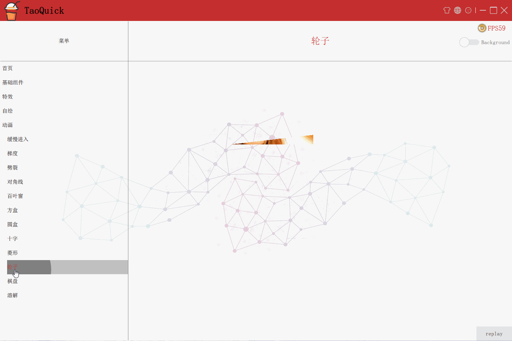

# 目录
- [目录](#%E7%9B%AE%E5%BD%95)
- [动画效果预览](#%E5%8A%A8%E7%94%BB%E6%95%88%E6%9E%9C%E9%A2%84%E8%A7%88)
  - [进场动画预览](#%E8%BF%9B%E5%9C%BA%E5%8A%A8%E7%94%BB%E9%A2%84%E8%A7%88)
    - [进入](#%E8%BF%9B%E5%85%A5)
    - [梯度](#%E6%A2%AF%E5%BA%A6)
    - [劈裂](#%E5%8A%88%E8%A3%82)
    - [对角线](#%E5%AF%B9%E8%A7%92%E7%BA%BF)
    - [百叶窗](#%E7%99%BE%E5%8F%B6%E7%AA%97)
    - [方盒](#%E6%96%B9%E7%9B%92)
    - [圆盒](#%E5%9C%86%E7%9B%92)
    - [十字](#%E5%8D%81%E5%AD%97)
    - [菱形](#%E8%8F%B1%E5%BD%A2)
    - [轮子](#%E8%BD%AE%E5%AD%90)
    - [棋盘](#%E6%A3%8B%E7%9B%98)
    - [溶解](#%E6%BA%B6%E8%A7%A3)

# 动画效果预览
## 进场动画预览
### 进入

### 梯度

### 劈裂

### 对角线

### 百叶窗

### 方盒

### 圆盒

### 十字

### 菱形

### 轮子

### 棋盘

### 溶解

