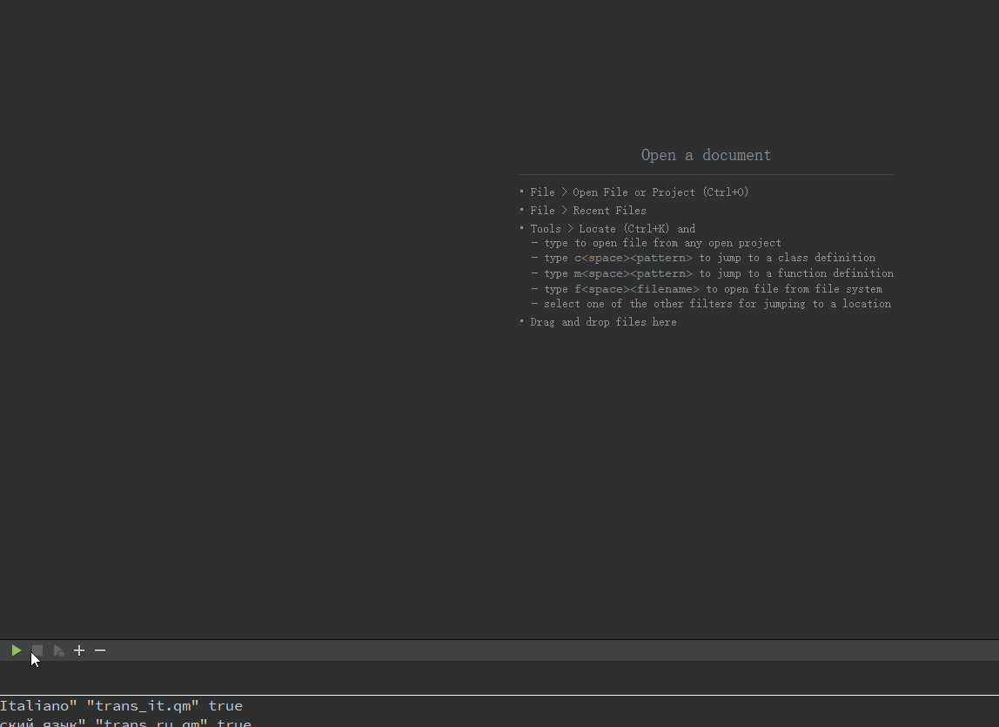
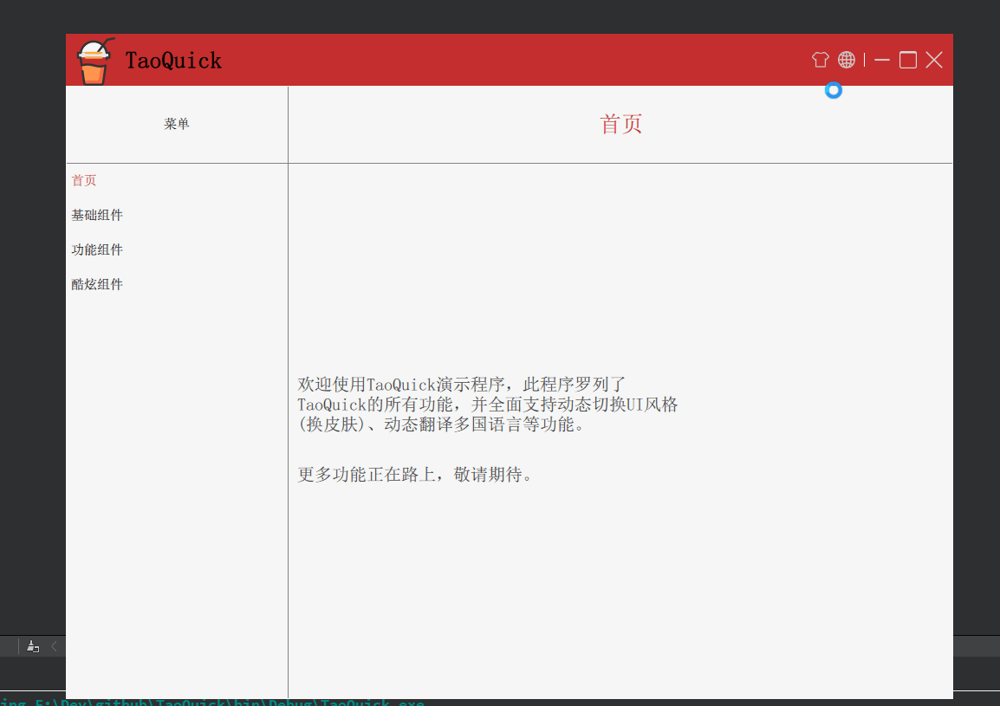
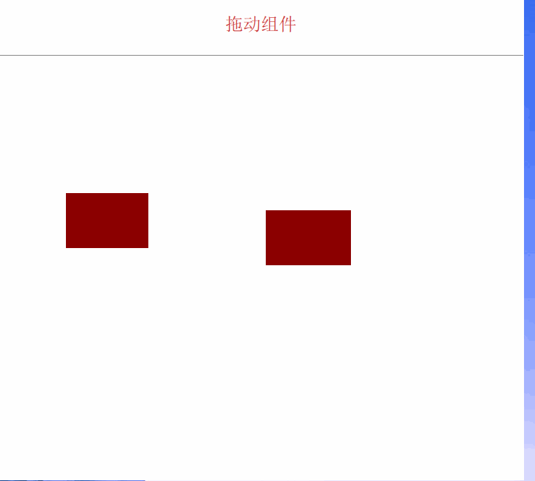
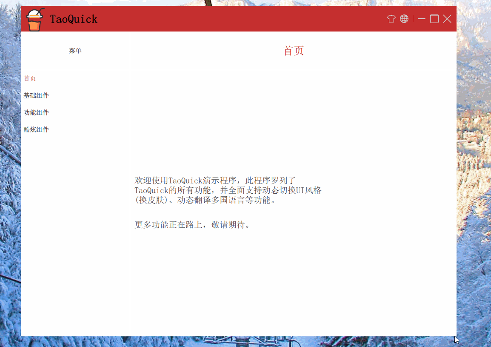
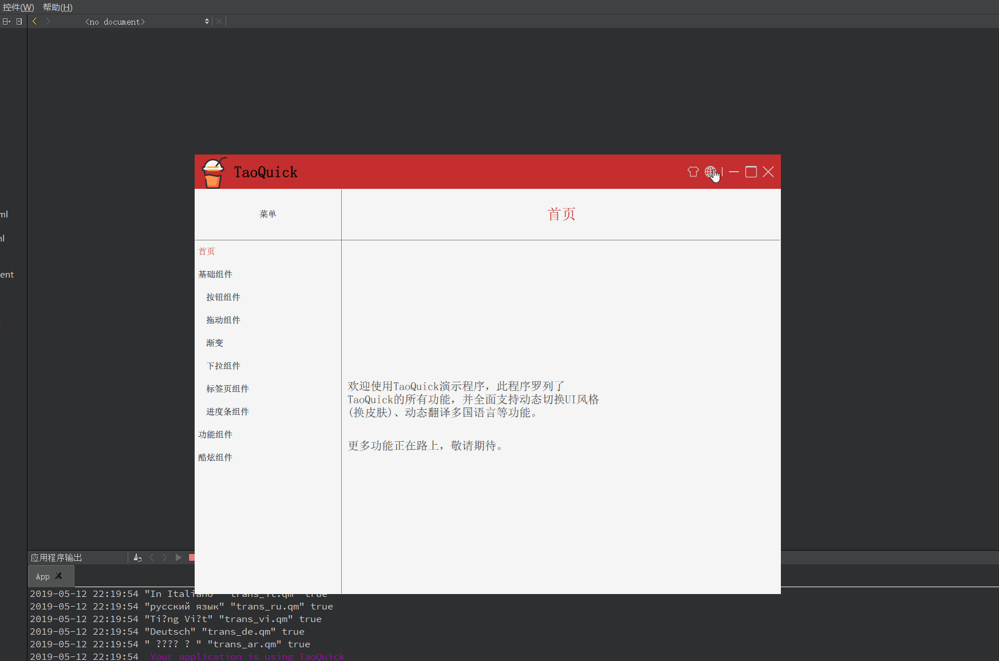
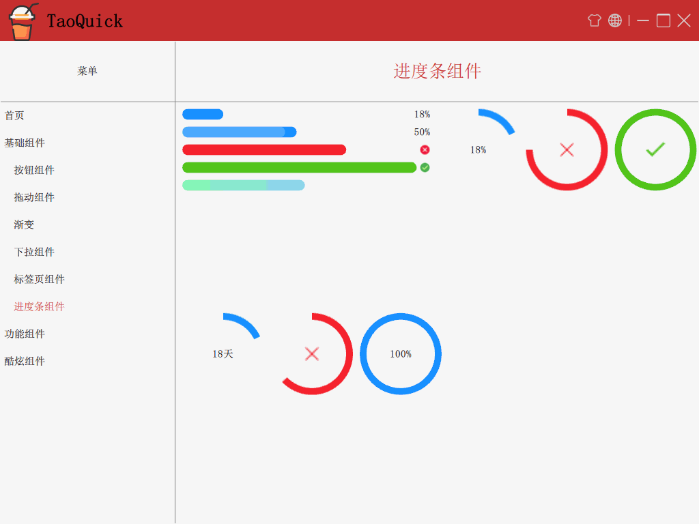

# 目录
- [效果预览](#%E6%95%88%E6%9E%9C%E9%A2%84%E8%A7%88)
  - [启动界面](#%E5%90%AF%E5%8A%A8%E7%95%8C%E9%9D%A2)
  - [动态换皮肤](#%E5%8A%A8%E6%80%81%E6%8D%A2%E7%9A%AE%E8%82%A4)
  - [按钮控件](#%E6%8C%89%E9%92%AE%E6%8E%A7%E4%BB%B6)
  - [拖拽控件](#%E6%8B%96%E6%8B%BD%E6%8E%A7%E4%BB%B6)
  - [自定义窗口](#%E8%87%AA%E5%AE%9A%E4%B9%89%E7%AA%97%E5%8F%A3)
  - [多国语言](#%E5%A4%9A%E5%9B%BD%E8%AF%AD%E8%A8%80)
  - [渐变](#%E6%B8%90%E5%8F%98)
  - [进度条](#%E8%BF%9B%E5%BA%A6%E6%9D%A1)

## 效果预览

### 启动界面

### 动态换皮肤

### 按钮控件

### 拖拽控件

### 自定义窗口

### 多国语言

### 进度条

